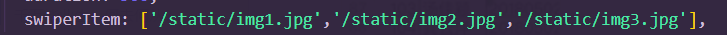
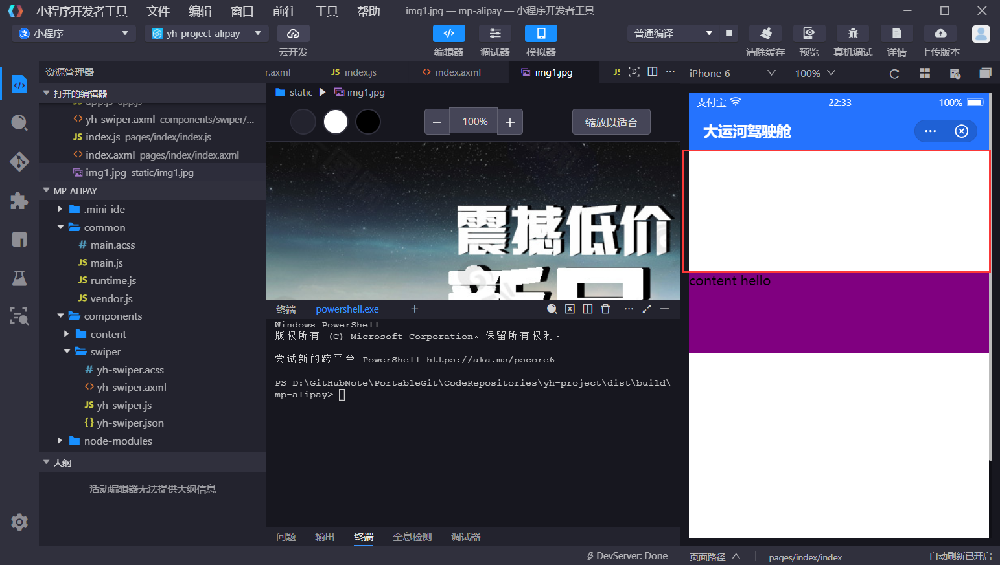

# WorkTasks

本人常用用户名密码集合：

```java
h5售房手机端：
    我的用户名/密码
	13545035011/123456
    
公司自己的仓库：
    http://ys.hztujing.com:9901/
    我的用户名/密码：zangziwei/123456
        

    
    
    
    
    
    
    
    
    
```


## uni-app

### 1、开发环境节点端口配置

- 官方文档里面明明有说明，但是就是没有写端口的配置，就很离谱。。。
- 

### 2、vscode快捷注释失效

- 按ctrl + /发现注释失效了。
- 使用ctrl + shift + p 打开命令搜索窗口，然后搜索注释，把快捷键改一下就行了。

### 3、导航栏配置在微信端和钉钉端失效的问题

- 官方文档上说就是页面的导航栏的配置可以由pages.json页面中的节点进行配置的，然后捏我就去配置了


在这个h5的页面端显示的时候是没有任何问题的，但是打包后在微信端和钉钉端的编译就出现了问题，这些导航栏的配置根本显示不出来。。。结果还是得用page-mate写：


这样写打包成微信端和小程序端就可以正常显示了。

- **<font color='purple'>文档上说了好像有三个端，一个web h5，一个是APP端，还有一个小程序端，上面的pages节点中的配置很多可以实现很多的样式，这些配置在h5端和APP端都可以比较好的使用，但是在小程序段就无能为力了，给爷看乐了🤣</font>**

### 4、头部组件开发

**<font color='red'>有两个问题没有解决：1个是头部导航栏的那个高度问题，我不知道怎么把高度调整高一点，文档里面没有相关的属性的配置的，然后还有一点就是那个钉钉小程序的那个头部的title无法居中的问题，明明我也设置了居中在h5端和微信端都是没有问题的，但是钉钉小程序就是无法居中，初步认为是钉钉内置的样式特效导致的</font>**

#### part1：导航栏高度问题？


##### 解决：https://uniapp.dcloud.net.cn/collocation/pages.html#style


#### part2：钉钉标题居中问题


##### 解决：

#### part3：组件内容显示不出来

**<font color='red'>我封装了头部的组件，然后在h5调试的时候都显示不出来，就很离谱。。。然后我又封装了一个测试的content的组件，放在index页面上，结果也是没有显示出来。。。？</font>**


- 这里我还特意使用Import导入组件，但是就是显示不出来。


##### 解决：组件导入时大写


- **<font color='purple'>组件在封装的时候最好都先大写，符合vue2的组件开发要求。然后别忘记在pages.json中进行页面的配置，就算不进行路由也是得先配置的。</font>**

- **<font color='red'>pages.json页面配置注意点：</font>**

  


### 5、uni-app开发注意

#### 5.1、根元素唯一


**<font color='purple'>在\<template>模板中根元素必须唯一，虽然在公司电脑上写两个根元素没有问题？这个我也搞不清楚是什么问题，有可能是版本问题，不过为了规范性和兼容性考虑，请遵守这个准则！</font>**

#### 5.2、*组件导入的坑

- **组件可以按照经典的vue2.x的import模式进行导入也可以采用最新的easycome导入方式，[easycome导入](https://uniapp.dcloud.net.cn/collocation/pages.html#easycom)，注意如果按照[vue2.x组件命名标准](https://cn.vuejs.org/v2/style-guide/#%E5%9F%BA%E7%A1%80%E7%BB%84%E4%BB%B6%E5%90%8D%E5%BC%BA%E7%83%88%E6%8E%A8%E8%8D%90)进行导入，不然很有可能有莫名奇妙的报错的。。。**

  - **<font color='purple'>建议给组件命名时，使用`xxx-xxx-...`的形式，这种形式既符合组件命名规范，又符合easycome的导入方式</font>**

  如图：

  

  - **<font color='red'>如果使用大写的驼峰组件命名方式，easycome就不支持了。。。如图：</font>**

  

  - 然后就报错了。。。

  

#### 5.3、小程序打包的坑

打包错误：


- **因为是文件名的关系，在小程序端进行打包，项目的文件名中不能包含-的，所以还是改成import导入吧，想想<font color='blue'>如果坚持用easycome导入，又要满足打包小程序不报错，那只能文件名和组件名相同并且小写，然后使用的时候大写，不然不可能了。</font>**

#### 5.4、本地图片显示的坑

**本来想在轮播图中显示图片的，然后使用img标签，不过发现在打包微信的时候图片的缩放不对，然后打包钉钉的时候发现图片显示不出来。。。没能解决这个问题；之后采用了背景图片的技术方案、用div然后样式设置如下：**

```css
.swiper-img{
	width:100%;
	height: 100%;
	/* background-image: url('~@/static/img1.jpg');  */
	/* background-repeat: no-repeat; */
	/* background-position: center; */
	background-size:100% 100%;  /**背景图片的大小 */
}

```


- **然后dom的代码大概是这个样子的（源码删了），绑定style动态变量，然后就可以用v-for了，然后就是url这里使用es6的模板字符串，然后在打包微信的时候又出现问题了。。。就是图片的缩放不对了。然后把style中的background改成backgroundImage就正确了，我也不懂为什么，总之就是感觉很乱。然后打包钉钉还是失败了！**

**<font color='purple'>方向调整：使用上面的技术方案结果小问题一大堆，不知道从何解决起，还是自己一点一点试出来的，然后就想用uni-app官网提供的cover-view参考它的写法应该不会有太多问题了吧，结果钉钉小程序还是有问题，不懂。</font>**


item项：




- 这样写的话在微信小程序上没有问题的，都很正常，但是钉钉就是显示不出来。。。



小结：

1. 使用本地图片的时候不要用相对路径和@开头的绝对路径，那个就算参照官方文档上的~@打包后还是显示不出来的。。。就是用/static的绝对路径就行了。
2. 不考虑使用base64的编码格式，因为它太长了，打包体积都大了太多。
3. 参考了各种的manifset中的小程序打包的设置都不能解决钉钉图片显示不出来的问题，不懂了。
4. 解决这个问题主要以下三个方向：1cover-img标签深入，2小程序打包配置文件，3看看钉钉的官方文档怎么说的吧。

### 6、uniapp-先后

- **<font color='purple'>看了一下uni-app的视频教程，发现原来底部的tabbar可以直接通过pages.json中的文件进行配置好的，这就是一个很重要的先后顺序的问题了，就是先有pages.json中的配置文件，然后再有那些个uni-app封装好的组件的。所以先搞定配置文件然后再搞定内置组件会比较好。</font>**

##### bug:【提示组件不存在】

- 通过pages.json的tabbar节点配置好底部的导航栏之后，然后运行报如下的错误：


**<font color='purple'>解决：之前在index.vue组件中使用了YhTabbar组件，然后删掉该组件的时候忘记把使用给删了，删除掉就好了。</font>**


##### bug:【底部tabbar图片显示不出来】


**<font color='purple'>解决：图片名字写错了。。。</font>**


**打包编译的结果：就是tabbar能对微信小程序有又很好的适配性，但是钉钉小程序就很死相了，不仅图片显示不出来，而且底部的tabbar也是显示不出来的，给爷整🤮🤡了。**


## 北向房销维护

### 1、prototype原型

最好的教程：https://www.bilibili.com/video/BV1gE411f7Fu?p=19&spm_id_from=333.851.header_right.history_list.click

- 在项目中就是使用Vue.prototype属性注册的全局getDicts方法，所以有必要去学习一下js prototype这个东西的。

#### 1.1、作用

功能：返回对象类型原型的引用

用法：Class.prototype  //注意这里是类名，不是对象！

#### 1.2、原理图


- 其实就是一个道理，就是**<font color='purple'>没有的属性/方法到原型对象里面找</font>**，Person类中，如果没有age属性，你实例化一个person对象，然后用person.age是获取不到的对吧，如果你使用了Person.prototype.age = 30;相当于在Person原型对象中添加了一个age属性，值是30；这时候person对象就会根据指向原型对象的[[prototype]]指针来到原型对象中找找有没有这个属性，有了，用person.age时它的值就是30了。
- 还有一个比较容易混淆的，person.age = 20;注意这个是一个赋值语句，就是说在**<font color='purple'>Person类中动态添加一个age的属性</font>**，值为20；同时是不会改变原型对象中的age值的。

### 2、vue2.x代理配置


### 3、无

- 就是我发现北向房销对**<font color='purple'>请求的封装</font>**做的很好，就是一个组件对应一个js文件，这个js文件中封装好了该组件的所有请求，然后导入axios的原始封装，这种结构很好。【可以解决智慧工地中请求封装的问题】

- **<font color='purple'>函数封装导出 + 添加函数到Vue原型对象</font>**；就是像函数封装好之后导出，再用import导入的封装模式是非常常用的，然后就是添加函数给原型对象，然后Vue对象就有了全局的方法，这种设计思想应该主要是用于全局对象和全局方法而言的

- **<font color='purple'>快速定位目标组件</font>**：就是给你看一下跑起来的项目，快速定位到组件的位置。uniapp看pages.json，vue可以看路由。

- 拉取+启动项目的基础步骤**：1、先git clone下来项目；<font color='red'>2、进入到项目目标文件夹；3、npm install 下载依赖；</font>4、然后npm run dev/serve**
  - 这个很基础东西我还是要记录一下，这个是一切的基础，对吧，而我经常把2,3两步搞错，这就很麻烦了！以后不要记错了！

**<font color='blue'>然后再研究一下项目的目录结构，看看他们是怎么安排的。</font>**

### 4、bug【stylelint样式检查错误】

就是启动的时候报错了。。。


- 凯哥说这个是stylelint导致样式语法错误，不知道为什么。

**<font color='green'>解决：这个的报错主要是因为stylelint的样式检查问题，因为我写的是rgb(21，45， 76， 70%);而rgb中是没有第四个参数的，所以就会自动转成rgb(21 45 76 /70%);的格式，然后就会报没有获取到argument $green的错误了；<font color='red'>首先得先换成rgba的然后再使用stylelint的自动修复功能取消对这一行的检查就行了。</font></font>**

如图所示：


