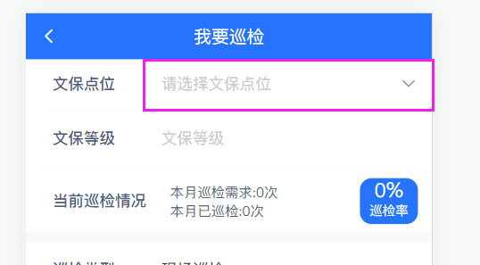

# 开发思路

# 大运河-H5

## 1、多文件导入

```js
const files = require.context('./modules', false, /\.js/);
const routes = [];

files.keys().map(file => {
  const route = files(file).default;
  routes.push(...route);
});
```

**==从./modules文件夹下，导入后缀名为.js的文件，false代表不递归查找modules目录==**

- **files：是webpack打包函数**

  

- **files.keys()：导入文件的路径（相对于./modules文件夹）**


- **files(file)：是一个Obj对象**


- **files(file).default：是文件中导出的对象**


我们导入的文件参考：

```js
//  主页路由模块
const Tabbar = [
  {
    path: '/home',
    name: 'Home',
    component: () => import('@/views/Home'),
    meta: {
      title: '首页',
      description: '文物汇治',
      icon: require('@/assets/svg/home.svg'),
      chooseIcon: require('@/assets/svg/home_choose.svg')
    }
  },
  {
    path: '/eventsort',
    name: 'EventSort',
    component: () => import('@/views/appCenter'),
    meta: {
      title: '应用中心',
      description: '应用中心',
      icon: require('@/assets/svg/yingyong.svg'),
      chooseIcon: require('@/assets/svg/yingyong_choose.svg')
    }
  },
  {
    path: '/message',
    name: 'Message',
    component: () => import('@/views/message'),
    meta: {
      title: '消息',
      description: '消息',
      icon: require('@/assets/svg/Messages.svg'),
      chooseIcon: require('@/assets/svg/Messages_choose.svg')
    }
  },
  {
    path: '/my',
    name: 'My',
    component: () => import('@/views/my'),
    meta: {
      title: '我的',
      description: '我的',
      icon: require('@/assets/svg/my.svg'),
      chooseIcon: require('@/assets/svg/my_choose.svg')
    }
  }
];

export default Tabbar;

```


## 2、编程式路由跳转

详细教程：
https://router.vuejs.org/zh/guide/essentials/navigation.html#%E5%AF%BC%E8%88%AA%E5%88%B0%E4%B8%8D%E5%90%8C%E7%9A%84%E4%BD%8D%E7%BD%AE

==this.$router主要有push、go、replace方法==

### 2.1、this.$router.push

- ***<font color='red'>跳转到目标路由的组件，会创建和销毁组件的</font>***

***下面是push的两个最主要的写法，两种写法不能混用，有path就没有params，这是定死的。***

```js
// 命名的路由，并加上参数，让路由建立 url
router.push({ name: 'user', params: { username: 'eduardo' } })

// 带查询参数，结果是 /register?plan=private
router.push({ path: '/register', query: { plan: 'private' } })
```


### 2.2、this.$router.replace

- ***<font color='red'>替换当前页面的路径，它在导航时不会向 history 添加新记录，正如它的名字所暗示的那样——它取代了当前的条目。</font>***

```js
router.push({ path: '/home', replace: true })
// 相当于
router.replace({ path: '/home' })
```


### 2.3、this.$router.go

- *<font color='red'>**该方法采用一个整数作为参数，表示在历史堆栈中前进或后退多少步，类似于**</font>*

```js
// 向前移动一条记录，与 router.forward() 相同
router.go(1)

// 返回一条记录，与 router.back() 相同
router.go(-1)
```


在大运河主页的Menu模块中有如下的代码：


==现在我已经进入了主页，当我向后台主页请求时，如果返回的是403（这里写的不够严谨）那么就代表你没有权限访问，难怪这/noauth对应的组件也还需要token登录，**<font color='red'>因为它的作用是，你在登录了之后，然后查看一些以你的权限无法查看的页面，然后才会出现没有权限啊</font>**==


## 3、我要巡检页面代码讲解


这个页面最重要的就是那个确认提交按钮了，提交按钮实现如下：

```js
    async handleSubmit() {
      // 1、首先一定要对文保点的选择进行校验，如果没有点位信息，则不进行提交
      const { bumpPointId } = this.form;
      if (!bumpPointId) {
        TipsPop({
          message: '文保点位未选择',
          type: 'fail'
        });
        return;
      }

      // 2、其次如果是远程巡检的话，就要对代巡检人进行校验，如果没有代巡检人，则不进行提交
      if (this.form.type === '0' && !this.form.remark) {
        TipsPop({
          message: '代巡检人未填',
          type: 'fail'
        });
        return;
      }

      // 3、然后如果是有问题的话，那就对问题描述情况进行过滤
      if (+this.checkRadio === 1) {
        const { problemRemark } = this.form;
        const imgList = this.$refs.uploadFile.imgFileList;
        const wentiList = this.checkQuestion;
        if (!problemRemark || !wentiList.length > 0) {
          TipsPop({
            message: '问题未选择或描述',
            type: 'fail'
          });
          return;
        }
        if (imgList.length === 0) {
          TipsPop({
            message: '图片未上传',
            type: 'fail'
          });
          return;
        }
      }

      // 4、最后进行手机端获取经纬度点位的判断，先判断是否有点位，再进行ToastLoading提交加载提示
      const pos = await getLocalPosition();
      if (!pos) {
        return;
      }


      const { Success, Fail } = ToastLoading({
        text: '正在提交中',
        success: '提交成功',
        fail: '提交失败'
      });

      if (this.isLoad) {
        return;
      }
      this.isLoad = true;

      const form = { ...this.form, lon: pos.longitude, lat: pos.latitude };
      form.files = [
        ...this.$refs.uploadFile.imgFileList,
        ...this.$refs.uploadFile.videoFileList,
        ...this.$refs.audioFile.audioList
      ];
      form.problemList = this.checkQuestion.join(';');
      form.problemExist = this.checkRadio;
      const fileViews = this.fileViewList.map((item, index, arr) => {
        return {
          fileUrl: item.fileUrl.replaceAll(process.env.VUE_APP_BASE_API, ''),
          fileUrlOrig: item.fileUrlOrig.replaceAll(
            process.env.VUE_APP_BASE_API,
            ''
          ),
          remark: item.remark,
          type: item.type
        };
      });
      form.files = [...form.files, ...fileViews];

      postPollingReport(form).then(response => {
        console.log('已经提交的表单', form);
        if (response.code === 200) {
          setTimeout(() => {
            Success(() => {
              this.isLoad = false;
              this.resetForm();
              this.$router.go(-1);
            });
          }, 1000 * 1);
        } else {
          Fail(response.msg);
        }
        this.isLoad = false;
      });
    },
```


### **==<font color='red'>提交的业务逻辑主要分为两大块，一个是提交前的校验，一个是提交的表单和后台接口：</font>==**

**校验部分：一般来说，<font color='blue'>校验的代码都是从上到下写下来的</font>，就如同上面的代码，先对是否选择了文保点位进行校验，如果没有选择，就直接给出一个弹窗，然后return;不让函数继续执行了；然后再对巡检人进行校验，如果没有选择巡检人也是给一个弹窗，然后return掉。**


对于是否存在问题的校验，有点神奇，就是

```js
      if (+this.checkRadio === 1) 
```

### **==<font color='blue'>这个前面的+是强制转换成Number类型的意思，因为this.checkRadio的值是 '0' 或者 '1'所以要用这个+进行强转，强转的列表如下所示：</font>==**

```js
// null：返回 0
console.info(+null) // => 0
// undefined：返回 NaN
console.info(+undefined) // => NaN
// 获取当前的时间戳，相当于`new Date().getTime()`
console.info(+new Date())
// 布尔型转换为整型：true 返回 1，false 返回 0
console.info(+true) // => 1
console.info(+false) // => 0
// 空字符串：返回0
console.info(+'') // => 0
// 忽略前面的 0
console.info(+'010') // => 10
// 16进制转换成 10进制
console.info(+'0x3E8') // => 1000
// 科学计数法自动解析
console.info(+'1e3') // => 1000
console.info(+'1e-3') // => 0.001
// 无法解析的格式：返回 null
console.info(+'1,000') // => NaN
```


在获取点位的代码中，做了封装：

```js
import { getLocalPosition } from '@/utils/dd';     

......
		// 4、最后进行手机端获取经纬度点位的判断，先判断是否有点位，再进行ToastLoading提交加载提示
      const pos = await getLocalPosition();
      if (!pos) {
        return;
      }
```

dd.js中的封装；

```js
export const getLocalPosition = () => {
  return new Promise((resolve, reject) => {
    const channel = getChannel();
    if (channel === 'h5') {
      TipsConfirm({
        message: '当前定位未获取，是否继续提交',
        confirm: () => {
          resolve({ longitude: 0, latitude: 0 })
        },
        cancel: () => {
          resolve(false)
        }
      });
    } else if (channel === 'dingding') {
      dd.device.geolocation.get({
        targetAccuracy: Number,
        coordinate: Number,
        withReGeocode: Boolean,
        useCache: true, // 默认是true，如果需要频繁获取地理位置，请设置false
        onSuccess: function (result) {
          resolve(result);
        },
        onFail: function (err) {
          TipsConfirm({
            message: '当前定位未获取，是否继续提交',
            confirm: () => {
              resolve({ longitude:0, latitude:0});
            },
            cancel: () => {
              resolve(false);
            }
          });

        }
      });
    } else if (channel === 'zzd') {
      resolve();
    }
  });
};
```

可见getLocalPosition这个函数返回一个Promise对象，那Promise对象长什么样的呢？我们可以在console.log一下Promise对象


Promise对象如下所示，状态是pending，然后结果实undefined：


之所以是这样的，因为界面如图所示：


### **==<font color='red'>Promise对象在等待用户点击，确认或者取消按钮，所以我们可以知道，当返回new Promise对象的时候，Promise对象就已经一整个返回了，但是它的状态是pending；所以await getLocalPosition()还在阻塞中，没有执行下去；只有用户点击了确认或者取消，然后resolve(返回的结果)才能够置，Promise的状态为fuling，并且返回resolve中的结果。</font>==**

  

我们再来看看TipsConfirm的封装

```js
      TipsConfirm({
        message: '当前定位未获取，是否继续提交',
        confirm: () => {
          resolve({ longitude: 0, latitude: 0 })
        },
        cancel: () => {
          resolve(false)
        }
      });
```

他其实是对vant组件 Dialog.Confirm的封装

```js
// 提示对话框
export const TipsConfirm = ({ message, confirm , cancel, confirmColor = '#2573fe', cancelColor = '#EB3941'}) => {
  Dialog.confirm({
    message: message,
    confirmButtonColor: confirmColor,
    cancelButtonColor: cancelColor
  })
    .then(confirm)
    .catch(cancel);
}

//第二种传递函数参数的方法
// 提示对话框
export const TipsConfirm = ({ message, confirm , cancel, confirmColor = '#2573fe', cancelColor = '#EB3941'}) => {
  Dialog.confirm({
    message: message,
    confirmButtonColor: confirmColor,
    cancelButtonColor: cancelColor
  })
    .then(() => {
      confirm && confirm();
    })
    .catch(() => {
      cancel && cancel();
    });
}


```

### ==这个封装最重要的就是教会我们**<font color='red'>如何把函数作为参数传递给另一个函数</font>**，还有就是**<font color='red'>这个传递参数的方法，其实就是ES6的解构，和默认参数</font>**==

### 

我们再看看这个提交函数中最难的部分：就是提交过程中弹窗的封装：

```js
      // 5、提交中提示框的封装
      const { Success, Fail } = ToastLoading({
        text: '正在提交中',
        success: '提交成功',
        fail: '提交失败'
      });

      if (this.isLoad) {
        return;
      }
      this.isLoad = true;
```

这个封装非常的牛逼，我们可以看一下它的封装：

```js
export const ToastLoading = ({ text = '加载中...', success = '加载完成', fail = '加载失败' }) => {
  Toast.loading({
    message: text,
    forbidClick: true,
    duration: 0
  });
  // 成功具备回调函数
  const Success = fn => {
    Toast.clear();
    Toast.success({
      message: success,
      forbidClick: true,
      duration: 1000,
      onClose: () => {
        fn && fn();
      }
    });
  };
  // 失败具备动态文本
  const Fail = str => {
    Toast.clear();
    Toast.fail({
      message: str || fail,
      forbidClick: true
    });
  };
  return {
    Success,
    Fail
  };
};
```

### ==这个函数封装的牛逼之处在于，**<font color='#ff0066'>它不仅执行了过程，而且还定义了两个函数，return 出去可以供外部函数进行调用。（闭包）而且更重要的是onClose: () => { fn && fn(); }这段代码的意思是指，fn是一个函数，然后再执行fn()这个函数，不是我以前想的 fn || fn()！！！那个是错误的观念！！！</font>**==

**<font color='#ff0066'>这里fn => {}的写法就等价于 const Success = (fn) => {...}，意思是将函数传递进来然后赋值给onClose属性，我们看看在提交函数中调用Success的时候传递了什么</font>**


**<font color='#ff0066'>主要是把加载状态置为false，然后清空提交的表单，这些后续的清理工作，这里的isLoad提一下，就是为了防止在提交的过程中（*正在提交宽*弹出来的时候，用户再次点击提交而设计的）</font>**


## 4、文保点位选择页面详解


```js
```


### 4.1、页面缓存

文保点位选择页面是由 我要巡检页面跳转过来的，点击文保点位，就跳转到这个页面了



我们在我要巡检页面的created钩子函数中发现了这样一段代码：

```js
  created() {

    this.SET_KEEPLIST(['AddInspection']);

    // 文保列表
    getPointList().then(response => {
      this.pointList = response.data;
    });
    // 巡检类型
    getPollingTypeList().then(response => {
      this.pollingTypeList = response.data;
      this.showData.typeName = this.pollingTypeList[0].label;
      this.form.type = this.pollingTypeList[0].value;
    });
    // 问题列表
    getProblemList().then(response => {
      this.questionList = response.data;
    });
  }
```

==这个this.SET_KEEPLIST把组件名'AddInspection'存放在了vuex的state中，然后跳转到文宝点选择页面后，组件就不会被销毁，而是被缓存起来了，这个我也不太清楚是为什么？？既没有在外层包裹\<keep-alive>，又没有在mate中设置keepAlive:true，仅仅就是凭借着把组件名存放在vuex中，就能实现缓存，我也是一脸懵笔。。。==


==还有一个问题，就是在选择完了文保点位，点击确定后，是怎么把数据传给 我要巡检 组件的？？？==


**<font color='#ff0066'>答案就在这里，就是文保点页面返回后，*我要巡检*组件的 activated钩子就被触发了，就是当组件在被缓存起来的时候，deactived钩子触发，当组件再次激活的时候，activated触发了，所以就可以把数据拿来然后对页面进行渲染了。https://vuejs.bootcss.com/api/#keep-alive，这里把KEEPLIST进行清空，代表该组件不再缓存，可以清空之前的数据（不过好像没有用的...）</font>**

然后我们再看看getDetail()函数

```js
    // 获取数据
    getDetail(id) {
      getPointDataList({ bumpPointId: id || this.wenbaoId }).then(res => {
        if (res.code === 200) {
          this.pointOnConfirm(res.data);
          this.SET_KEEPLIST(['AddInspection']);
        }
      });
    },
```

发现，当数据成功返回的时候，组件又通过SET_KEEPLIST缓存起来了，然后this.pointOnConfirm就是用来进行对页面进行渲染的。


### **==<font color='#ff0066'>可以通过，1：vuex对组件进行缓存（不知道原理）:2：然后组件缓存切换后传递数据的方法就只能通过vuex了，因为组件的缓存导致路由传参就失效了（因为路由传参需要重新创建组件的）；3：然后是activated钩子函数</font>==**


### 4.2、多级选择逻辑


初始化：

```js
  created() {
    getPointArea().then(res => {
      this.inspectionTypeList.push(...res.data);
    });

    getPointStreet().then(res => {
      this.distributeTypeList.push(...res.data);
    });

    getPointGrid().then(res => {
      this.gridTypeList.push(...res.data);
    });

    this.resetScroll();
    this.getList(1, true);
  }
```

把三个级别的所有数据都拿到手，所以刚一开始的时候，三个选择都是有数据的：

- 点击选择区：


- 选择街道：


- 选择片区：


***<font color='red'>不过当你选择了上级，就会影响下级的选项了；而相反的选择下级不会影响上级，因为下级永远是上级的子级了：</font>***

```js
    // 选择区
    inspectionTypeOnConfirm(item) {
      this.distributeTypeList = [{ label: '全部', value: '' }];
      this.gridTypeList = [{ label: '全部', value: '' }];
      // 重置子级
      this.showData = {
        districtIdL3: '',
        districtIdL4: '',
        districtGridId: ''
      };
      this.searchParam.districtIdL3 = '';
      this.searchParam.districtIdL4 = '';
      this.searchParam.districtGridId = '';
      // 选择街道、镇
      // if (item.value !== '') {
      getPointStreet({ parentId: item.id }).then(res => {
        this.distributeTypeList.push(...res.data);
      });
      // }
      this.showData.districtIdL3 = item.label;
      this.searchParam.districtIdL3 = item.value;
      this.isShowInspectionType = false;
      this.initScroll = false;
      this.getList(1, true);
    },
    // 选择街道、镇筛选框确认
    distributeTypeOnConfirm(item) {
      this.gridTypeList = [{ label: '全部', value: '' }];
      this.showData.districtGridId = '';
      this.searchParam.districtGridId = '';
      this.showData.districtIdL4 = '';
      this.searchParam.districtIdL4 = '';
      // 选择片区
      getPointGrid({ districtId: item.id }).then(res => {
        console.log('--', res);
        this.gridTypeList.push(...res.data);
      });
      this.showData.districtIdL4 = item.label;
      this.searchParam.districtIdL4 = item.value;
      this.isShowDistributeType = false;
      this.initScroll = false;
      this.getList(1, true);
    },
    // 选择片区确认
    gridTypeListOnConfirm(item) {
      this.showData.districtGridId = item.label;
      this.searchParam.districtGridId = item.value;
      this.isShowGridType = false;
      this.initScroll = false;
      this.getList(1, true);
    },
```

### **==<font color='#0099ff'>这个多级选择的代码逻辑很 常用，就是当它选择第一级别的时候，第二第三级别的内容都被清空了，然后根据第一级别的id去获取第二级别的所有数据，然后就不管第三级别了（因为如果要管的话，得把第二级别的结果每一个都去后台请求它的子级，太烦了！！！）然后重置表单，获取下面的列表数据；当你选择第二级别的时候，先把第三级别的数据清空，然后根据选中的id去获取第三级别的数据列表，然后重置表单，获取下面的列表数据</font>==**

### 4.3、Promise中的setTimeOut

我们来看看获取列表函数：

```js
    // 获取列表
    getList(pageNum, isAutoRender) {
      const form = { ...this.searchParam };
      form.pageNum = pageNum;
      console.log('查询的表单',form);
      return new Promise((resolve, reject) => {
        // 1、真正获取所有点位的数据就是在这里，就是请求后台的接口对吧
        // 只不过，会根据form表单提交的数据不同，从而改变返回的数据而已，
        // 所以在外面要套一层壳，用来截取传递给后台的参数用的。

        /**
         * 2、在Promise中，不允许使用const { data } = await getPointList(form);
         * 因为Promise本来就是 允诺异步返还给你一个结果的，可你倒好，硬是用await和async把别人变成同步的。。。
         * 那当热不乐意了。
         * 
         */

        getPointList(form).then(res => {
          const list = res.data;
          this.searchParam.pageNum = pageNum;
          if (isAutoRender) {
            this.renderData(list, true);
          }
          resolve(list);
        });


        // setTimeout(resolve('zzw'),1000 * 1000);

        // setTimeout(() => {
        //   resolve(true);
        // },0);

      });
    },
```

==这里setTimeout(resolve('zzw'),1000* 1)这样没有匿名回调函数的话，会导致立刻执行resolve('zzw')的。这种语法错误要注意一下!==


