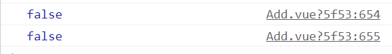

# 开发细节

# 1、vue不支持数组长度为空的判定

```js
          <div class="betweenSpace" v-if="wenbaoPointViewList !== []"></div>
```

- **<font color='purple'>如果这样写的话，当wenbaoPointViewList为空时，他还是会显示的，换成v-show也是一样的；而且用!=和!==也都是不行的，所以只能用.length !\== 0来进行判定。。。</font>**

之所以出现上面的情况，看下面的代码就知道了：

```js
    const arr = [];
    console.log(arr === []);
    console.log(arr == []);
```

结果：


**==<font color='#ff3399'>因为本质上数组是指针，所以 \=\= 的隐式转换没有作用，而又因为是指针，所以指向的地址不同，一定是不相等的！！！</font>==**


- 问题：图片缩放的问题，如果不是宽高一样，缩放的宽和高应该这么确定？

# 2、在img标签外套div，div的高度会变高一点

```html
              <div class="imgBox" v-for="(item, index) in fileViewList" :key="index">
                
              </div>
```

- **<font color='purple'>如果图片的宽和高都是100px，那么div的宽高会是100，104.8。。。</font>**


# 3、导入导出注意：

如果导出是这样的：

```js
import Vue from 'vue';
export const EventBus = new Vue();
```

那么导入应该是这样的：

```js
import { eventBus } from '@/utils/event-bus'
```


如果导出是这样的：

```js
import Vue from 'vue';
const EventBus = new Vue();
export default EventBus;
```

那么导入应该是这样的：

```js
import eventBus from '@/utils/event-bus'
```

**==<font color='#ff3399'>简单的说，如果导出没有default的话，需要在导入的时候进行解构：</font>==**


